# Product Requirements Document (PRD) & Technical Architecture

**Project Title**: Personal Portfolio Website 
**Target Repository**: [rashed](file:///e:/Protfolio_mine/rashed)  
**Status**: Ready for Review / Step-by-Step Implementation  
**Version**: 1.0.0  

---

## 1. Executive Summary & Objectives

### 1.1 Objective
Design and engineer an exact-aesthetic, high-performance personal portfolio website mirroring the refined editorial / warm-earthy tech style of [shahadishraq.com](https://shahadishraq.com/), personalized with the developer's identity, photo, skills, experience, and projects.

### 1.2 Core Success Metrics
* **Visual Polish**: 1:1 parity with the editorial aesthetic — warm cream light mode, deep espresso dark mode, crisp 2px neobrutalist card borders, concentric avatar rings, and fluid hover animations.
* **Performance**: 100/100 Lighthouse score (Performance, Accessibility, Best Practices, SEO).
* **Zero Overhead**: Pure semantic HTML5, Vanilla CSS3 (custom properties / variables), and minimal Vanilla JavaScript. No framework overhead, no build tools required to preview or deploy.
* **Full Responsiveness**: Seamless experience from mobile (<768px) to desktop (>=1200px) with responsive navigation drawer and adaptive multi-column grids.
* **SEO & Accessibility**: Fully accessible (WCAG 2.1 AA compliant), keyboard navigable, semantic elements, skip-to-content link, Open Graph metadata, and JSON-LD schema.org structured data.

---

## 2. Design System & Aesthetics

### 2.1 Color Palette & Theme Tokens
The design employs an editorial, warm-earthy palette that communicates craftsmanship and seniority:

| Token | Light Theme (`:root`) | Dark Theme (`:root[data-theme="dark"]`) | Description |
| :--- | :--- | :--- | :--- |
| `--bg-primary` | `#fffefa` (Warm Cream) | `#1c1a17` (Deep Espresso) | Main background |
| `--bg-secondary` | `#f8f6f2` (Soft Parchment) | `#252320` (Dark Charcoal Brown) | Cards, header, footer |
| `--bg-tertiary` | `#efeae3` (Muted Sand) | `#2f2c28` (Elevated Surface) | Interactive hover, code blocks |
| `--text-primary` | `#2a2420` (Dark Roast) | `#f8f6f2` (Off-white Cream) | Headings and primary text |
| `--text-secondary` | `#3a3430` (Muted Dark) | `#e0dcd7` (Muted Light) | Subtitles, body paragraphs |
| `--text-tertiary` | `#5a5550` (Warm Gray) | `#b8b4af` (Muted Gray) | Timestamps, metadata, footnotes |
| `--border-color` | `#e8e3dc` (Subtle Divider) | `#3a3633` (Subtle Dark Border) | Hairline borders and dividers |
| `--accent` | `#a47864` (Terracotta/Bronze) | `#c4977f` (Warm Luminous Bronze) | Primary brand accent & highlights |
| `--accent-hover` | `#8b6652` (Deep Terracotta) | `#d4a893` (Bright Luminous Bronze) | Accent button/link hover state |
| `--accent-light` | `#f4ede8` (Light Bronze Tint) | `#3a342f` (Dark Bronze Tint) | Badges, tags, avatar aura |

### 2.2 Typography
* **Primary Font**: `-apple-system, BlinkMacSystemFont, "Segoe UI", Roboto, "Helvetica Neue", Arial, sans-serif`
* **Code / Monospace**: `"SF Mono", Monaco, "Cascadia Code", "Courier New", monospace`
* **Letter Spacing**: `-0.02em` on headings (`h1` - `h3`) for a tight editorial finish; `-0.01em` on body text.
* **Line Heights**: `1.3` for headings; `1.6` to `1.8` for narrative text and lists.

### 2.3 Visual Signatures
1. **Avatar Ring & Pulse Glow**:
   * Circular profile image surrounded by a 4px accent border + 8px concentric outer ring (`--accent-light`).
   * Subtle infinite pulsating radial gradient backdrop (`animation: subtle-pulse 8s ease-in-out infinite`).
2. **Neobrutalist Refined Cards**:
   * Clean surface background, crisp `2px solid var(--text-primary)` border (light mode) or `2px solid var(--accent)` (dark mode).
   * Border radius of `1rem` (`--border-radius-xl`), soft shadow (`0 4px 16px rgba(42,36,32,0.12)`).
   * Micro-interaction: Slides `translateY(-3px)` to `-6px` on hover with a progressive top/left accent gradient indicator.
3. **Pill Badges & Tags**:
   * Light accent background (`--accent-light`), bold text (`--accent`), rounded pill shape, hover invert.
4. **Header Glassmorphism**:
   * Sticky top bar with `backdrop-filter: blur(12px) saturate(180%)`, semi-transparent background, and bottom hairline border.

---

## 3. Information Architecture & Page Sections

```mermaid
graph TD
    A[index.html] --> B[Sticky Navigation Header]
    B --> B1[Logo / Name]
    B --> B2[Nav Links: Home, Experience, Skills, Projects, Contact]
    B --> B3[Theme Toggle: Dark/Light Mode]
    B --> B4[Mobile Hamburger Menu]

    A --> C[Hero Section]
    C --> C1[Profile Avatar with Concentric Rings]
    C --> C2[Headline & Subtitle: Title / Role]
    C --> C3[Tagline / Core Value Proposition]
    C --> C4[Action Buttons: Resume, GitHub, LinkedIn, Email, Coffee Popover]

    A --> D[Professional Summary Callout]
    A --> E[Experience Timeline Section]
    E --> E1[Role Cards with Metrics & Technologies Used]

    A --> F[Technical Skills Section]
    F --> F1[Skill Category Cards with Tag Pills]

    A --> G[Education & Certifications]
    G --> G1[Degree Card BUET / Academic Background]
    G --> G2[Certifications Grid]

    A --> H[Featured Projects Section]
    H --> H1[Project Cards with Icons, Tech Badges & GitHub / Live Links]

    A --> I[Contact Section]
    I --> I1[Call to Action: 'Let's Build Something Together']
    I --> I2[Direct Email & Social Connect Buttons]

    A --> J[Semantic Footer]
    J --> J1[Copyright & Tech Disclaimer]
    J --> J2[Social Links & Support Trigger]
```



---

## 4. Functional Specifications

### 4.1 Theme Engine (`js/main.js`)
* **Default Theme**: Detects system preference via `window.matchMedia('(prefers-color-scheme: dark)')`.
* **User Persistence**: Stores user selection (`light` or `dark`) in `localStorage.getItem('theme')`.
* **Instant Application**: Script executes in the `<head>` or before DOM paint to prevent Theme Flash / FOUC (Flash of Unstyled Content).
* **Toggle Interaction**: Smooth CSS variable transitions (`150ms - 250ms`) with sun/moon SVG icon swap.

### 4.2 Responsive Navigation
* **Desktop**: Horizontal flex menu with animated bottom underline hover indicators.
* **Mobile (<768px)**: Animated hamburger icon transforming into an 'X', revealing a mobile dropdown drawer with full screen backdrop.
* **Smooth Anchor Scrolling**: Clean scroll behavior (`scroll-behavior: smooth`) with scroll padding offset matching header height (`70px`).

### 4.3 Support / 'Buy Me a Coffee' Popover
* Accessible popover modal with QR code image, direct external link, and a 1-click **"Copy Link"** button providing dynamic copied feedback (`Copied!`).
* Auto-closes on outside click or `Escape` key press.

### 4.4 SEO, Metadata & Schema.org
* Canonical URL and responsive viewport `<meta>` tags.
* OpenGraph tags (`og:title`, `og:description`, `og:image`, `og:type`, `og:url`).
* Twitter Card tags (`summary_large_image`).
* JSON-LD structured data (`@type: Person` and `@type: WebSite`).

---

## 5. File & Directory Structure

The project structure will be clean, static, and production-ready:

```
e:/Protfolio_mine/rashed/
├── index.html              # Main single-page portfolio
├── prd.md                  # This specifications document
├── css/
│   └── style.css           # Complete design system & responsive styling
├── js/
│   └── main.js             # Theme toggle, mobile menu, coffee modal, link copy
├── images/
│   ├── profile.jpg         # Developer photo
│   ├── favicon.ico         # Browser favicon
│   ├── buymeacoffee-qr.png # QR code for support popover
│   └── projects/           # Custom project logos / thumbnail icons
└── assets/                 # Resume PDF and other static downloads
```

---

## 6. Phased Step-by-Step Implementation Plan

### Phase 1: Foundation Setup
* [ ] Verify file tree and initialize `css/style.css` with CSS custom properties (light + dark mode).
* [ ] Initialize `js/main.js` with theme switcher (FOUC-safe) and event handlers.
* [ ] Establish base HTML skeleton in `index.html` with SEO meta tags, skip link, and responsive viewport.

### Phase 2: Header & Hero Section
* [ ] Build sticky glassmorphism header with logo, navigation links, theme toggle, and mobile menu.
* [ ] Implement Hero section with circular avatar, concentric ring glow, name, subtitle, bio tagline, and social pill links.
* [ ] Integrate Buy Me a Coffee interactive popover.

### Phase 3: Experience & Professional Summary
* [ ] Build the Professional Summary highlight card.
* [ ] Build the Experience section with role cards, date ranges, achievements, bold highlights, and tech stack tags.

### Phase 4: Skills, Certifications & Education
* [ ] Build the Technical Skills grid organized by categories (Frontend, Backend, Database, Cloud/DevOps, Tools).
* [ ] Build Education and Certifications cards.

### Phase 5: Featured Projects & Contact CTA
* [ ] Build Featured Projects cards with project icons, descriptions, tag pills, and external link buttons.
* [ ] Build the Contact section ("Let's Build Something Together") and semantic footer.

### Phase 6: Polish, Verification & Deployment Readiness
* [ ] Cross-browser testing and mobile responsiveness validation.
* [ ] Lighthouse audit verification (Performance, Accessibility, SEO).
* [ ] Git commit and final walkthrough.

---

## 7. Developer Inputs Required (To Personalize)

To customize the content accurately, the following information can be plugged into the template:
1. **Name & Title**: Developer's formal name and current professional title.
2. **Photo**: High-resolution headshot file to place in `images/profile.jpg`.
3. **Short Tagline / Bio**: 1-2 sentence core value proposition.
4. **Work History**: Companies, titles, employment dates, and key accomplishments.
5. **Key Skills**: Categorized technical proficiencies and primary specialty badges.
6. **Projects**: Names, descriptions, tech stack, and GitHub / live demo links.
7. **Social Profiles**: Links for GitHub, LinkedIn, Email, and Resume.
